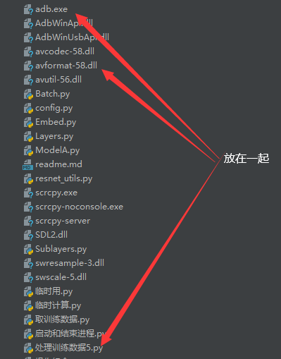
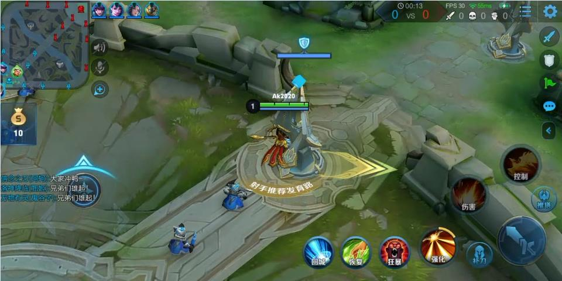
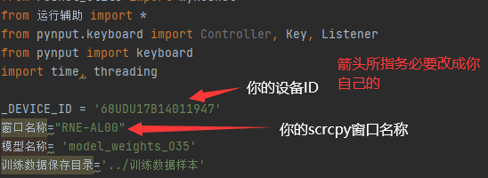
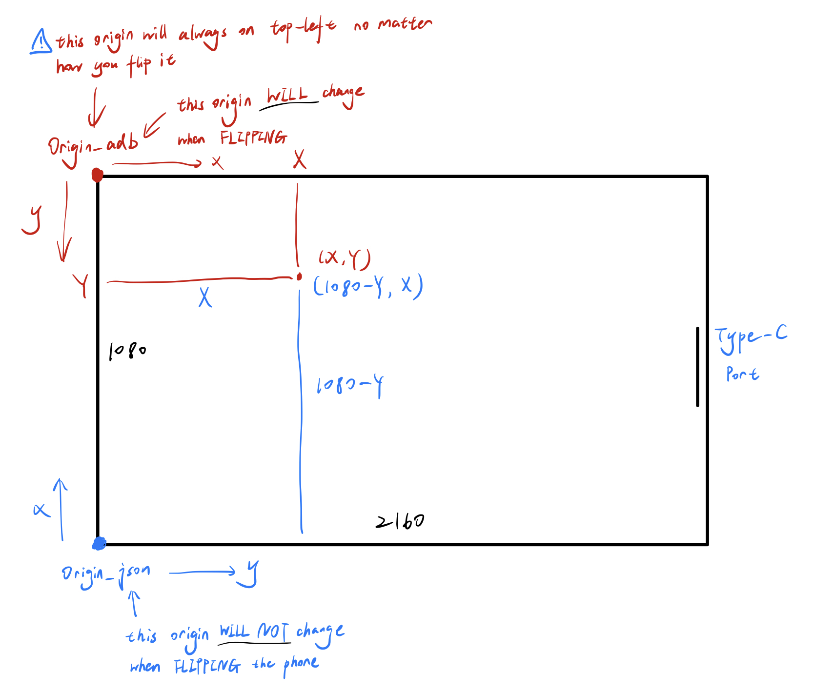

# 基于pytorch框架用resnet101加GPT搭建AI玩Timi
   本源码模型主要用了[SamLynnEvans Transformer](https://github.com/SamLynnEvans/Transformer) 的源码的解码部分。以及pytorch自带的预训练模型"resnet101-5d3b4d8f.pth"
# 注意！！！ 
本项目不再更新,由[用强化学习训练AI玩王者](https://github.com/FengQuanLi/WZCQ)代替。     

# 注意运行本代码需要注意以下几点 注意！！！！！
1、目前这个模型在用后裔100多局对战数据下训练出来后，对局表现出各种送人头之类的问题，以及代码本身各种不规范，请多原谅。  
2、本代码本来只是我试验模型能否玩王者荣耀，B站朋友强烈要求开源。仓促开源估计问题很多，请多原谅。  
三、运行环境win10；win7未测试，估计是可以。  需要一张6G或以上显存的英伟达显卡，虽然4G的1050ti勉强也可以。  
四、需要一台打开安卓调试并能玩王者荣耀的手机，虚拟机没有试过，理论上应该可行。  
五、需要下载[scrcpy](https://github.com/Genymobile/scrcpy/blob/master/README.zh-Hans.md)  的windows版本。 把所有文件解压到项目根目录即可（这是我的笨办法） 。  
位置如图  
  
六、pyminitouch库运行时会自动安装minitouch。如果无法自动安装则需要手动安装[minitouch](https://github.com/openstf/minitouch) ，比较麻烦，如有困难请多多百度。  
还有，minitouch不支持Android10  
七、本人用的手机分辨率是1080*2160的，本代码并没有针对不同的手机做优化。不同的手机minitouch命令中所描述的位置会有差异，需要对代码做出相应调整，请务必注意。  
八、注意游戏的布局，务必要一样。布局可参考B站视频或者我上传的训练用截图。如图。  
  
九、游戏更新以后可能会导致无法预料的后果，因此并不能保证此代码玩王者荣耀的长期有效性。  
我之后可能出视频教程，同时讲讲我的设计思路。部分地区截图不可见，可下载项目在pycharm下打开readme.md即可见。

# 运行与生成训练数据
需要的库  
torch  
torchvision    
pynput  
pyminitouch  
可能还有其它库

## 运行训练好的模型
如果前面的工作做好了就可以把模型跑起来了，这里声明这个经过训练的模型仅仅训练100多局，水平很低，青铜人机都未必能打过。  
一、首先下载模型 你可以从[google云盘](https://drive.google.com/file/d/1HaDIMeVNixbGWViuBqvZr6uicyAUiyYT/view?usp=sharing) 下载训练过的模型，也可以百度网盘下载  
链接：https://pan.baidu.com/s/1Bt7BXukDDCpc1aWFI2iKxg   
提取码：5c1k  
后放入weights文件夹下  
二、先运行 “启动和结束进程.py” 启动scrcpy
把“训练数据截取_A.py” 中的两项改成你的，_DEVICE_ID 是 adb devices后显示的那个id  
  
三、启动王者荣耀进入5v5人机对战    运行 “训练数据截取_A.py” 即可。
## 生成训练数据
运行 “训练数据截取_A.py” 时可以通过按键操控角色，这时就可以生成训练用的数据，如果没有操控则会生成一个空文件夹和空json文件。  
按"i"键则结束或则是重新运行  
按键'w' 's ' 'a' 'd'控制方向  左、下、右箭头对应是1、2、3技能，上箭头长按则攻击。其它按键请参考源码。   
每次获取训练图片最好不要超过5000张  

你也可以下载训练数据样本（只是样本，数据量不大，不能指望两局对战数据就有效果，我估计这个模型现有参数可以吃下上万场的对战数据）  
百度网盘
链接：https://pan.baidu.com/s/1Ak1sLcSRimMWRgagXGahTg 
提取码：t4k3   
[google云盘](https://drive.google.com/file/d/1plN4xDaGgdRGiy6LT4qHG9O7US2I7_oS/view?usp=sharing)  
解压后注意存放位置，请参考源码。
# 如何训练
一、数据预处理  
将图片用resnet101预处理后再和对应操作数据一起处理后用numpy数组储存备用。  
具体要做的就是运行 “处理训练数据5.py”   
二、训练  
预处理完成以后运行 “训练_B.py”即可。

# 游戏按键映射本地化
按键映射通过 './json/名称_操作.json' 文件完成，如前文所述，由[minitouch](https://github.com/openstf/minitouch)进行按压模拟。
1. 前期准备：

开启“开发者模式”，允许“USB调试”，允许“USB调试（安全设置）：允许通过USB调试修改权限或模拟点击”。后两项均在进入开发者选项后可以找到。

2. 按键可视化，按键轨迹监控：

开启“显示点按操作的视觉反馈”，开启“指针位置”。后者方便查看自己手机屏幕点按的像素点坐标信息，从而生成对应本地手机按键映射的.json文件。

3. 映射本地化计算说明：

此计算以手机充电口朝右握持为例，反向握持同理可推。样例手机分辨率1080x2160。
Android“指针位置”中显示的坐标信息以图中左上角红色原点所示，xy轴如图。此原点不论如何握持（充电口朝左或右），其始终保持在视野左上角，由重力感应判定。
minitouch坐标原点如图中左下角蓝色原点所示，此点为物理固定点，不随手机握持方向改变，反向握持此点在右上角。
另外注意两个坐标系xy轴方向不同。
在图中设定下，Android指针坐标(X,Y)对应minitouch坐标(1080-Y,X)：即在点按屏幕中某点时，安卓调试显示的(X,Y)在.json文件中的坐标应为(1080-Y,X)。

4. 本地映射文件生成：

'check_json.py'为调试和生成本地.json按键映射文件的脚本。重映射时请一一记录每个按键在自己手机中显示的“指针位置”，并按照上述计算方法换算为.json文件中需
要输入的坐标。此脚本会生成一个'./json/local_layout.json'文件，请在'处理训练数据5.py'中进行相应替换。
此外，'处理训练数据5.py'中：‘加一技能’，‘加二技能’，‘加三技能’，‘购买’变量也许进行同样处理。.json文件中指令含义请参照[minitouch](https://github.com/openstf/minitouch)。

